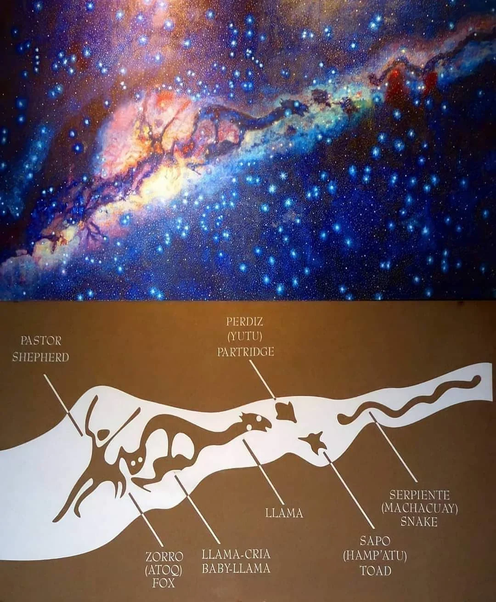

**FI**

*False Sky* ääni-installaatio tarkastelee eurosentrismiä negatiivisen tilan tulkinnan kautta. 

Melanien ollessa seitsemänvuotias hänen lempikirjansa oli suosittu tietosanakirja, joka käsitteli erilaisia tieteellisiä aiheita. Eniten niistä häntä kiehtoi tähtikuvioita käsittelevä luku. Melanie muistaa istuneensa usein iltaisin vanhempiensa talon pihalla Eteläisen Perun tähtitaivaan alla pienellä punaisella puujakkarallaan ja etsineensä turhaan kirjassa esitettyjä tähtikuvioita Isoa Karhua, Pientä Karhua, Kassiopeiaa ja Pohjantähteä. Sen sijaan Etelän risti, jonka hänen isoisänsä oli näyttänyt hänelle taivaalta, ei löytynyt kirjasta lainkaan.
 
Vasta ensimmäisellä talvisella matkallaan Suomeen hän tunnisti kaikki kirjan sivuilla kuvatut tähtikuviot. Yksi merkittävä piirre oli kuitenkin selvästi nähtävissä sekä hänen lapsuutensa yötaivaalla että pohjoisen pimeydessä, Linnunradan himmeästi kaartuva vana taivaan poikki.

Euroopassa konstellaatioita hahmotetaan yhdistämällä kirkkaita tähtiä toisiinsa, kun taas Andien alueen taivasta on hahmotettu toisella tavalla. Inkojen astronomian *mustat konstellaatiot* saavat hahmonsa Linnunradan valtavista tummista kosmisista pölypilvistä, valon sijaan ne muodostuvat negatiivisesta tilasta. Mustat konstellaatiot olivat inkojen maailmankuvassa tärkeimpiä tähtitaivaan kuvioita.

Teos yhdistää reaaliaikaisen Linnunradan radioteleskooppidatan Inkojen astronomian *mustiin konstellaatioihin*, joiden muodot piirtyvät esiin resonoivien levyjen pinnoilla äänellisinä rakenteina.

Installaatiossa neutraalin vedyn 1420 MHz taajuudelle viritetty radioteleskooppi vastaanottaa 21cm aallonpituutta Linnunradan Orionin paikallishaarasta sekä Perseuksen kierteishaarasta. Signaali muutetaan reaaliajassa kuuloalueelle ja sitä moduloidaan verhokäyrällä, joka on piirretty mustien konstellaatioiden kuvioita myötäillen eteläisen taivaan linnunradan tasoa pitkin. Näin resonoiville levyille piirtyy kuultavia hahmoja täällä näkymättömän tähtitaivaan osasta.

Artistit:
Heikki & Melanie Lindgren

    
**ENG**

*False Sky* sound installation explores Eurocentrism through the interpretation of the negative space. 

When Melanie was seven years old, her favorite book was a popular science encyclopedia explaining a wide range of scientific topics. The chapter she found most fascinating was the one about constellations. She remembers often sitting in the evenings on a small red wooden stool in the yard of her parents' house beneath the starry skies of southern Peru, unsuccessfully searching for the constellations shown in the book: Ursa Major, Ursa Minor, Cassiopeia, and the North Star. Yet the Southern Cross, which her grandfather had pointed out to her in the sky, was nowhere to be found in the book. It was only after her first journey to Finland in winter that she finally recognized all the constellations illustrated in its pages. One significant feature, however, was clearly visible both in the night sky of her childhood and in the northern darkness, the pale arc of the Milky Way.

While constellations of the European sky are drawn by connecting bright stars, the Andean sky is read and its figures lay in the dark cosmic clouds that run along the Milky Way, shapes made of the negative space instead of light. The dark constellations were the most significant ones for the Inca cosmovision.

Using real-time radio telescope data from the Milky Way, the work traces the forms of Inca dark constellations, which emerge as sonic structures on the surfaces of resonating plates.

In the installation, a radio telescope tuned to the neutral hydrogen line at 1420 MHz observes the 21-centimeter emission from the Milky Way's Local Orion Arm and the Perseus Arm. The received signals are sonified in real time and modulated by an envelope derived from dark constellation figures, creating audible traces of these forms through resonating plates.

Artists:
Heikki & Melanie Lindgren
 
 

@welcometoayacucho
 
 
 
Erityiskiitokset:  
Juha Lilja (Stealthcase), kokeellisen komposiittiantennin suunnittelu ja rakentaminen  
Joni Tammi, Aalto yliopisto, MRO, astronomiaan liittyvät neuvot  
Vesa Turunen, siirrettävän audiovahvistimen suunnittelu  
 

Special thanks:  
Juha Lilja (Stealthcase), the design and construction of the experimental composite antenna  
Joni Tammi (Aalto University, Metsähovi Radio Observatory), for advice on astronomy  
Vesa Turunen, portable audio amplifier design  
 
